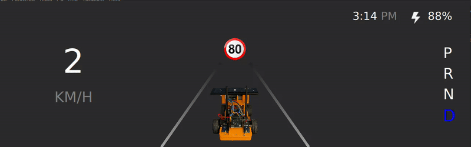

# 🚗 JetRacer Driving Features

This document showcases all the autonomous features developed for the JetRacer, each illustrated with a short demo GIF.

---

## 🔁 Adaptive Cruise Control (ACC)

The car maintains a safe distance from the vehicle ahead by adjusting its speed automatically.

  

---

## 🛣️ Lane Keeping Assist System (LKAS)

Keeps the car centered in its lane using lane detection and steering control.

  

  

---

## 🚶 Crosswalk Speed Reduction

Automatically reduces speed when approaching a pedestrian crosswalk.

  

---

## 🛑 Stop Sign Detection

Detects stop signs and makes a full stop before continuing.

  

---

## 🚦 Traffic Light Handling

Recognizes traffic light colors and responds accordingly (stop on red, go on green).

  

---

## 🚧 Obstacle Avoidance

Avoids static or dynamic obstacles on the road while keeping the lane.

  

---

## 🆘 Emergency Braking

Performs an emergency stop when a sudden obstacle is detected.

  

---

## ⛔ Trajectory Feasibility Check

Prevents the car from taking a path that is geometrically impossible or dangerous.

  

---

## 🔒 Safety Conditions

Ensures basic safety rules are always respected.

  

---

## 📌 Notes

- All features were tested in a controlled environment using the JetRacer.
- CAN protocol was used for communication between perception, control modules and UI instrument cluster.
