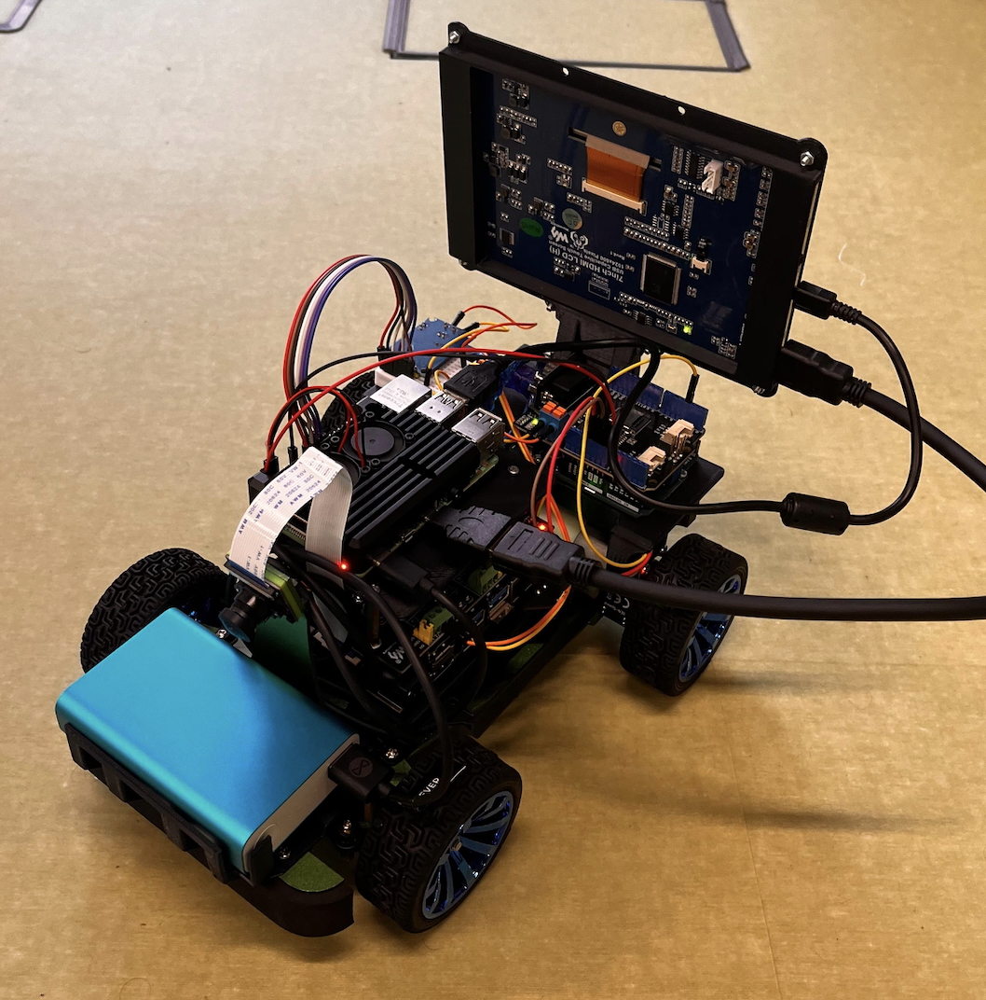
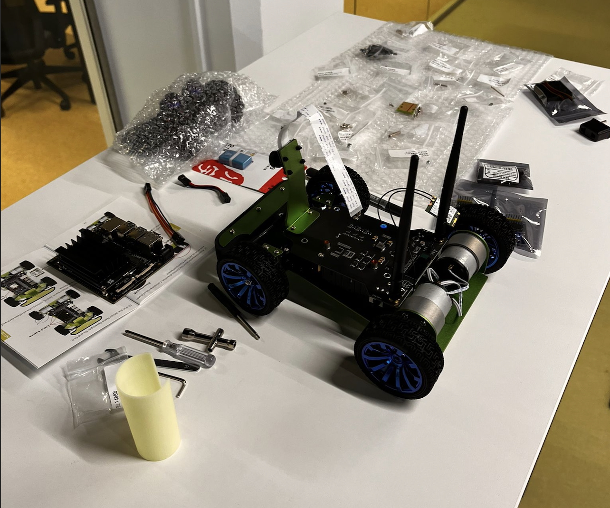
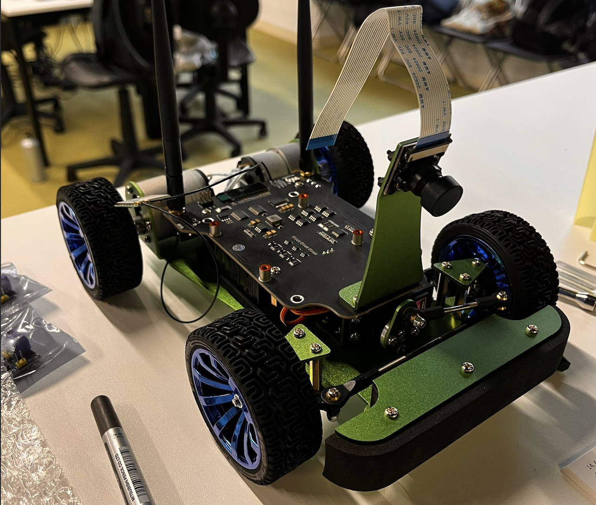
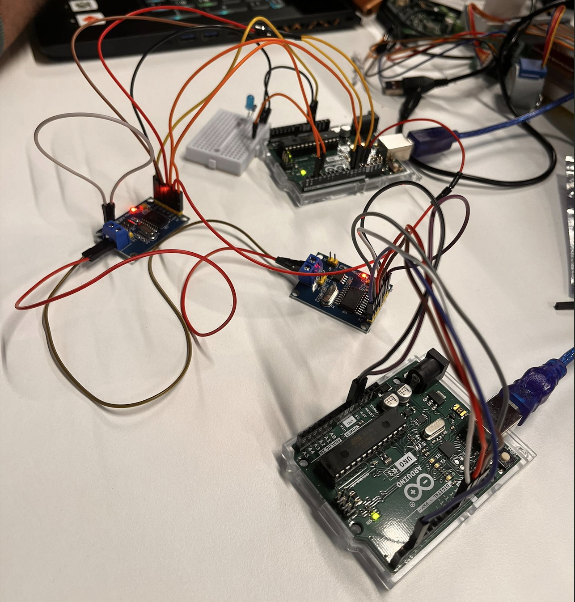
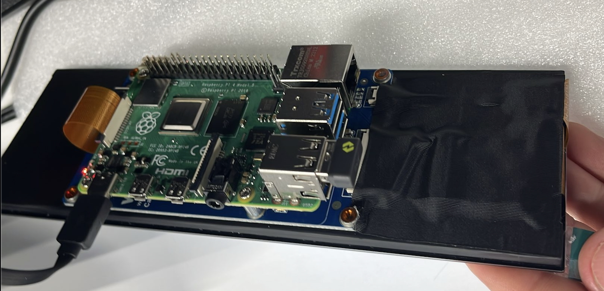

@page development_log JetRacer Progress Gallery

## Current State of Development: Wireless Hand Cluster

## Team Member Faking to work by the username: ruiolive

## JetRacer Current State

- Car assembled and working, 3D printed parts added for support.
- Bigger screen displaying the cluster.
- Extra Battery added.

## Assemble stage of JetRacer

First week.

### Closer look

## First steps in embeded programing

Practical researching on Can Bus Protocol.

## Oled Screen using RaspberryPi

### Notes: 
- Should add tools?
- Equipment?
- 3D models
- Update this acording to the course development

